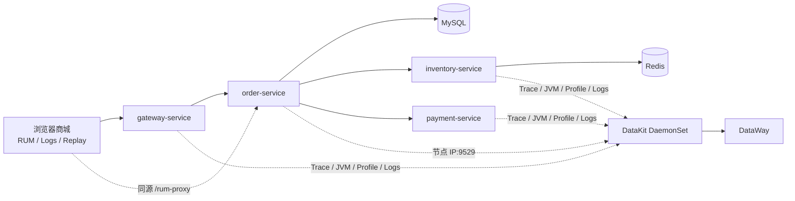

# Observability Demo

> A clean, deliberately faultable Java microservice demo for Kubernetes and DataKit. It demonstrates correlated infrastructure metrics, APM, logs, JVM metrics, profiling, RUM, Browser Logs, Session Replay and SourceMap restoration.

这是一个可公开发布、可逐步教学的全栈可观测 Demo。商城请求经过 `gateway → order → MySQL → inventory → Redis → payment`，并提供受口令保护的前端、服务、依赖和 JVM 故障场景。指标、链路、日志、JVM、Profile 与 RUM 默认统一使用 `project=mall-demo`；默认配置不包含任何真实凭证，Ingress 与 RUM 默认关闭，MySQL/Redis 数据为临时 Demo 数据。

## 架构



更多细节见 [架构与数据流](docs/architecture.md) 和 [可观测信号与字段](docs/observability.md)。

## 本地预览（Docker Compose）

要求：Docker Engine、Docker Compose v2、`curl`。

```bash
cp .env.example .env
# 修改 .env 中三个 change-me 值
docker compose up --build -d
open http://127.0.0.1:8080
```

只暴露 Gateway 的 `8080` 端口。首次注入或恢复故障时，页面会提示输入 `DEMO_CONTROL_TOKEN`；该值只保存在当前标签页的 `sessionStorage`。

```bash
export DEMO_CONTROL_TOKEN='与 .env 一致的值'
scripts/smoke-test.sh
scripts/generate-traffic.sh
scripts/inject-fault.sh payment_slow
scripts/inject-fault.sh off
docker compose down --volumes
```

如果主机已有 DataKit，将 `.env` 中 `DATAKIT_HOST` 设置为容器可访问的地址；不配置 DataKit 也可以预览业务和故障控制。

## EKS Workshop：分步安装 DataKit 与 Demo

DataKit 和应用保持为两个独立 Helm Release。教程会展示 DataKit 的真实配置；应用直接拉取公开 GHCR `latest` 镜像，不需要 Maven、Docker build 或镜像仓库登录。正式复现和问题排查仍可改用不可变的 SemVer tag。

### 0. 准备信息并声明参数

开始前先准备 DataWay URL，并在观测云创建 Web 类型的 RUM 应用、取得 Application ID。然后集中声明本次安装使用的参数；后续命令无需再修改：

```bash
export AWS_REGION="ap-northeast-2"
export EKS_CLUSTER_NAME="observability-demo"

# DataWay URL 包含敏感 token，使用隐藏输入，避免写入 Shell 历史。
read -rsp 'DataWay URL: ' DATAWAY_URL && export DATAWAY_URL && echo

# RUM Application ID 非敏感，不需要填写 Public DataWay client token。
read -rp 'RUM Application ID: ' RUM_APPLICATION_ID && export RUM_APPLICATION_ID

read -rp 'TrueWatch Workspace ID: ' TRUEWATCH_WORKSPACE_ID && export TRUEWATCH_WORKSPACE_ID
```

`project=mall-demo`、镜像标签 `latest`、DataKit namespace `datakit` 和应用 namespace `observability-demo` 是 Demo 固定值，不需要用户声明。

### 1. 连接 EKS

`kubectl` 尚未连接目标集群时执行：

```bash
aws eks update-kubeconfig \
  --region "$AWS_REGION" \
  --name "$EKS_CLUSTER_NAME"

kubectl config current-context
kubectl get nodes
```

如果 `kubectl get nodes` 已经能显示目标 EKS 的 Ready 节点，可以跳过 `update-kubeconfig`。

### 2. 配置并安装 DataKit

安装官方 DataKit Chart，并通过前面声明的参数传入 DataWay URL 和 EKS 集群名：

```bash
helm repo add datakit https://pubrepo.truewatch.com/chartrepo/datakit
helm repo update

helm upgrade --install datakit datakit/datakit \
  --version 2.5.0 \
  --namespace datakit \
  --create-namespace \
  -f observability/datakit-values.example.yaml \
  --set-string datakit.dataway_url="$DATAWAY_URL" \
  --set-string datakit.cluster_name_k8s="$EKS_CLUSTER_NAME"

unset DATAWAY_URL
```

仓库中的 values 开启 Kubernetes/容器与进程指标、eBPF L4/L7 网络流、DDTrace、JVM StatsD、Profile、RUM 和日志采集，并为独立 Demo 集群设置 `project=mall-demo`。日志保留完整原始 `message`，业务字段使用 [`observability/platform-log-pipeline.p`](observability/platform-log-pipeline.p) 在平台 Pipeline 中解析。真实 DataWay URL 由 chart 保存到 Kubernetes Secret，不写入仓库。

```bash
kubectl -n datakit get pods
kubectl -n datakit logs daemonset/datakit --tail=500 | grep -i ebpf
```

已有 DataKit Release 不需要卸载。拉取最新仓库后，从 `datakit-dataway-secret` 读取现有 DataWay URL，并重新执行上面的 `helm upgrade --install`，最后运行 `kubectl rollout status daemonset/datakit -n datakit --timeout=5m` 等待滚动升级完成。

如果这个 DataKit 还采集同一集群中的其他项目，应移除全局 `project`，只给 Demo workload 和应用信号设置该标签。参考 [DataKit Helm](https://docs.truewatch.com/datakit/datakit-helm/) 与 [Kubernetes 部署](https://docs.truewatch.com/en/datakit/datakit-daemonset-deploy/)。

### 3. 使用公开镜像部署应用

EKS overlay 只把 Gateway 暴露为 `LoadBalancer`；order、inventory、payment、MySQL 和 Redis 仍然是集群内部服务。

```bash
helm upgrade --install demo charts/observability-demo \
  --namespace observability-demo \
  --create-namespace \
  -f charts/observability-demo/values-eks.yaml \
  --set rum.enabled=true \
  --set-string rum.applicationId="$RUM_APPLICATION_ID" \
  --set-string observabilityConsole.workspaceId="$TRUEWATCH_WORKSPACE_ID"

unset RUM_APPLICATION_ID TRUEWATCH_WORKSPACE_ID

for deployment in $(kubectl -n observability-demo get deployments -o name); do
  kubectl -n observability-demo rollout status "$deployment" --timeout=8m
done
```

Chart 会在 `demo-observability-demo` Secret 中自动生成 Demo 内部密码和故障控制口令。

Chart 默认拉取 `ghcr.io/truewatchtech/observability-demo-{gateway,order,inventory,payment}-service:latest`，并使用 `imagePullPolicy: Always`。四个 GHCR Package 均为 Public，最终用户不需要执行 `docker login`。

### 4. 获取外部 URL

AWS 创建 Load Balancer 通常需要几分钟。等待 Gateway Service 的 `EXTERNAL-IP` 从 `<pending>` 变为 `*.elb.amazonaws.com`：

```bash
kubectl -n observability-demo get service \
  -l app.kubernetes.io/component=gateway-service \
  --watch
```

出现地址后按 `Ctrl+C`，输出可直接在浏览器打开的 URL：

```bash
export DEMO_BASE_URL="http://$(kubectl -n observability-demo get service \
  -l app.kubernetes.io/component=gateway-service \
  -o jsonpath='{.items[0].status.loadBalancer.ingress[0].hostname}')"
echo "$DEMO_BASE_URL"
```

这是 AWS 自动分配的公网 DNS，不要求提前购买或配置自有域名。该 Load Balancer 会产生 AWS 费用；Workshop 结束后应卸载应用。Java 容器使用 UID `10001`、只读根文件系统和最小权限 ServiceAccount；MySQL/Redis 使用 `emptyDir`，不适合保存生产数据。

### 5. 获取控制口令、验证并生成演示流量

网页首次执行故障操作时会要求输入控制口令。输出自动生成的值并复制到页面：

```bash
printf '%s\n' "$(kubectl -n observability-demo get secret demo-observability-demo \
  -o jsonpath='{.data.demo-control-token}' | base64 --decode)"
```

脚本验证使用同一个口令：

```bash
export DEMO_CONTROL_TOKEN="$(kubectl -n observability-demo get secret demo-observability-demo \
  -o jsonpath='{.data.demo-control-token}' | base64 --decode)"

scripts/smoke-test.sh
scripts/generate-traffic.sh
scripts/inject-fault.sh payment_slow
scripts/inject-fault.sh off
```

人工验收应覆盖按 `project=mall-demo` 过滤的 Node/Pod/容器指标、完整 Trace、日志关联、JVM、Profile，以及 RUM/Browser Logs/Replay/SourceMap。详见 [故障场景目录](docs/fault-scenarios.md)。

Workshop 结束后删除应用和公网 Load Balancer：

```bash
helm uninstall demo --namespace observability-demo
kubectl delete namespace observability-demo
```

### 6. 可选：在 EKS 节点部署 Agent Teams Runtime

Agent Teams Runtime 需要部署在能够访问目标工具和数据的环境中。Workshop 可将自托管 `obs-agent` 临时安装到一台 EKS EC2 工作节点，并授予 Kubernetes 只读权限；不支持 Fargate-only、Bottlerocket 或已经安装 `obs-agent` 的节点。脚本使用一个短生命周期的特权 helper Pod 进入目标节点，不修改 EC2 Node Role，也不依赖 SSM。执行者必须能够在集群中创建 privileged、hostPath 和 hostPID Pod。该方式只用于专用 Workshop 集群，不用于共享生产节点。

先在 Agent Workspace 中创建专用 Agent，并从该 Agent 的 **Run & Deploy** 页面取得 Agent ID、Agent API Key 和 Beak Endpoint。然后在安装 DataKit 与 Demo 时使用的管理员终端中执行：

```bash
export AWS_REGION="ap-northeast-1"
export EKS_CLUSTER_NAME="observability-demo"

# 非默认站点时，填写 Run & Deploy 安装命令中的 Endpoint。
export BEAK_ENDPOINT="https://agent-api.truewatch.com"

scripts/install-obs-agent-eks-node-demo.sh
```

脚本会选择一个 Ready 的 Linux 工作节点，创建临时 helper Pod，并通过加密的 Kubernetes exec 会话提示输入 Agent ID 和 Agent API Key。API Key 不会进入 Shell 历史、Pod 定义或仓库；helper Pod 会在安装结束或脚本退出时删除。节点上生成的 Kubernetes Token 默认有效期为 8 小时。

如果安装在完成前中断且仓库根目录已经生成 `.obs-agent-eks-node-demo.state`，请先执行 `scripts/install-obs-agent-eks-node-demo.sh --cleanup`，再重新安装。

完成 Agent Teams 演示后，在删除 EKS 节点前清理 Runtime、节点凭证和临时 Kubernetes RBAC：

```bash
scripts/install-obs-agent-eks-node-demo.sh --cleanup
```

## RUM 与配置边界

- DataWay URL：敏感，只通过 DataKit 安装环境传入。
- RUM application ID：非敏感，但必须先在可观测平台创建；默认 `RUM_ENABLED=false`。
- project：非敏感，默认 `mall-demo`，用于跨指标、链路、日志和 RUM 关联。
- workspace ID：用于 TrueWatch Trace 深链。
- control token：敏感，只存在 Compose 环境或 Kubernetes Secret，浏览器只保存于当前会话。

RUM 使用 DataKit Origin，通过同源 `/rum-proxy` 上报，不需要 Public DataWay client token。配置和 SourceMap 步骤见 [RUM、Replay 与 SourceMap](docs/rum-sourcemap.md)；client token 的适用范围见 [官方说明](https://docs.truewatch.com/en/management/client-token/)。

## 开发与发布检查

```bash
mvn verify
for script in scripts/*.sh; do bash -n "$script"; done
helm lint charts/observability-demo
scripts/secret-scan.sh
```

仓库仅保留三个 workflow：CI、SemVer 镜像发布和 CodeQL。推送 SemVer tag 会生成 `linux/amd64`、`linux/arm64` 镜像，同时发布不可变版本标签和 Workshop 使用的 `latest`，并生成 SBOM、provenance 和漏洞报告。

## License

[Apache License 2.0](LICENSE)
