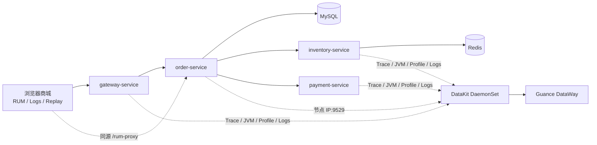

# Guance Observability Demo

> A clean, deliberately faultable Java microservice demo for Kubernetes, DataKit and Guance. It demonstrates correlated infrastructure metrics, APM, logs, JVM metrics, profiling, RUM, Browser Logs, Session Replay and SourceMap restoration.

这是一个可公开发布、可逐步教学的全栈可观测 Demo。商城请求经过 `gateway → order → MySQL → inventory → Redis → payment`，并提供受口令保护的前端、服务、依赖和 JVM 故障场景。指标、链路、日志、JVM、Profile 与 RUM 默认统一使用 `project=mall-demo`；默认配置不包含任何真实凭证，Ingress 与 RUM 默认关闭，MySQL/Redis 数据为临时 Demo 数据。

## 架构



更多细节见 [架构与数据流](docs/architecture.md) 和 [可观测信号与字段](docs/observability.md)。

## 本地预览（Docker Compose）

要求：Docker Engine、Docker Compose v2、`curl`。

```bash
cp .env.example .env
# 修改 .env 中三个 change-me 值
docker compose up --build -d
open http://127.0.0.1:8080
```

只暴露 Gateway 的 `8080` 端口。首次注入或恢复故障时，页面会提示输入 `DEMO_CONTROL_TOKEN`；该值只保存在当前标签页的 `sessionStorage`。

```bash
export DEMO_CONTROL_TOKEN='与 .env 一致的值'
scripts/smoke-test.sh
scripts/generate-traffic.sh
scripts/inject-fault.sh payment_slow
scripts/inject-fault.sh off
docker compose down --volumes
```

如果主机已有 DataKit，将 `.env` 中 `DATAKIT_HOST` 设置为容器可访问的地址；不配置 DataKit 也可以预览业务和故障控制。

## EKS Workshop：分步安装 DataKit 与 Demo

DataKit 和应用保持为两个独立 Helm Release。教程会展示 DataKit 的真实配置；应用则直接拉取 `GuanceDemo` 发布的四个公开 GHCR `latest` 镜像，不需要 Maven、Docker build、镜像仓库登录或 owner/tag 参数。正式复现和问题排查仍可改用不可变的 SemVer tag。

开始前确认 `kubectl` 已连接到目标 EKS 集群：

```bash
kubectl get nodes
```

### 1. 配置并安装 DataKit

在观测云工作空间的「集成 → DataKit」页面复制完整 DataWay URL。它包含敏感 token，只在终端的隐藏输入中填写：

```bash
helm repo add datakit https://pubrepo.guance.com/chartrepo/datakit
helm repo update

read -rsp 'DataWay URL: ' DATAWAY_URL && echo
helm upgrade --install datakit datakit/datakit \
  --version 2.5.0 \
  --namespace datakit \
  --create-namespace \
  -f observability/datakit-values.example.yaml \
  --set-string datakit.dataway_url="$DATAWAY_URL" \
  --set-string datakit.cluster_name_k8s="$(kubectl config current-context | awk -F/ '{print $NF}')"
unset DATAWAY_URL
```

仓库中的 values 开启 Kubernetes/容器指标、DDTrace、JVM StatsD、Profile、RUM、日志采集和 Pipeline，并为独立 Demo 集群设置 `project=mall-demo`。真实 DataWay URL 由 chart 保存到 Kubernetes Secret，不写入仓库。

```bash
kubectl -n datakit get pods
kubectl -n datakit logs daemonset/datakit --tail=100
```

如果这个 DataKit 还采集同一集群中的其他项目，应移除全局 `project`，只给 Demo workload 和应用信号设置该标签。参考 [DataKit Helm](https://docs.guance.com/datakit/datakit-helm/) 与 [Kubernetes 部署](https://docs.guance.com/en/datakit/datakit-daemonset-deploy/)。

### 2. 创建 RUM 应用

在观测云创建 Web 类型的 RUM 应用，复制非敏感的 Application ID。RUM 使用同源 `/rum-proxy` 转发到节点 DataKit，不需要 Public DataWay client token。

```bash
read -rp 'RUM Application ID: ' RUM_APPLICATION_ID
```

### 3. 创建 Demo 内部 Secret

MySQL 密码和故障控制口令由命令随机生成，用户无需填写：

```bash
kubectl create namespace guance-demo
kubectl -n guance-demo create secret generic guance-observability-demo \
  --from-literal=mysql-password="$(openssl rand -hex 16)" \
  --from-literal=mysql-root-password="$(openssl rand -hex 16)" \
  --from-literal=demo-control-token="$(openssl rand -hex 16)"
```

这些 Secret 只用于一次性的 Demo 数据和受保护的故障操作，不会提交到 Git。

### 4. 使用公开镜像部署应用

EKS overlay 只把 Gateway 暴露为 `LoadBalancer`；order、inventory、payment、MySQL 和 Redis 仍然是集群内部服务。

```bash
helm upgrade --install demo charts/guance-observability-demo \
  --namespace guance-demo \
  -f charts/guance-observability-demo/values-eks.yaml \
  --set rum.enabled=true \
  --set-string rum.applicationId="$RUM_APPLICATION_ID"
unset RUM_APPLICATION_ID

for deployment in $(kubectl -n guance-demo get deployments -o name); do
  kubectl -n guance-demo rollout status "$deployment" --timeout=8m
done
```

Chart 默认拉取 `ghcr.io/guancedemo/guance-observability-demo-{gateway,order,inventory,payment}-service:latest`，并使用 `imagePullPolicy: Always`。四个 GHCR Package 必须在首次发布后设为 Public，最终用户不需要执行 `docker login`。

### 5. 获取外部 URL

AWS 创建 Load Balancer 通常需要几分钟。等待 Gateway Service 的 `EXTERNAL-IP` 从 `<pending>` 变为 `*.elb.amazonaws.com`：

```bash
kubectl -n guance-demo get service \
  -l app.kubernetes.io/component=gateway-service \
  --watch
```

出现地址后按 `Ctrl+C`，输出可直接在浏览器打开的 URL：

```bash
export DEMO_BASE_URL="http://$(kubectl -n guance-demo get service \
  -l app.kubernetes.io/component=gateway-service \
  -o jsonpath='{.items[0].status.loadBalancer.ingress[0].hostname}')"
echo "$DEMO_BASE_URL"
```

这是 AWS 自动分配的公网 DNS，不要求提前购买或配置自有域名。该 Load Balancer 会产生 AWS 费用；Workshop 结束后应卸载应用。Java 容器使用 UID `10001`、只读根文件系统和最小权限 ServiceAccount；MySQL/Redis 使用 `emptyDir`，不适合保存生产数据。

### 6. 验证并生成演示流量

```bash
export DEMO_CONTROL_TOKEN="$(kubectl -n guance-demo get secret guance-observability-demo \
  -o jsonpath='{.data.demo-control-token}' | base64 --decode)"

scripts/smoke-test.sh
scripts/generate-traffic.sh
scripts/inject-fault.sh payment_slow
scripts/inject-fault.sh off
```

人工验收应覆盖按 `project=mall-demo` 过滤的 Node/Pod/容器指标、完整 Trace、日志关联、JVM、Profile，以及 RUM/Browser Logs/Replay/SourceMap。详见 [故障场景目录](docs/fault-scenarios.md)。

Workshop 结束后删除应用和公网 Load Balancer：

```bash
helm uninstall demo --namespace guance-demo
kubectl delete namespace guance-demo
```

## RUM 与配置边界

- DataWay URL：敏感，只通过 DataKit 安装环境传入。
- RUM application ID：非敏感，但必须先在 Guance 创建；默认 `RUM_ENABLED=false`。
- project：非敏感，默认 `mall-demo`，用于跨指标、链路、日志和 RUM 关联。
- workspace ID：可选，只用于 Console 深链；未配置时界面改为复制 trace ID。
- control token：敏感，只存在 Compose 环境或 Kubernetes Secret，浏览器只保存于当前会话。

RUM 使用 DataKit Origin，通过同源 `/rum-proxy` 上报，不需要 Public DataWay client token。配置和 SourceMap 步骤见 [RUM、Replay 与 SourceMap](docs/rum-sourcemap.md)；client token 的适用范围见 [官方说明](https://docs.guance.com/en/management/client-token/)。

## 开发与发布检查

```bash
mvn verify
for script in scripts/*.sh; do bash -n "$script"; done
helm lint charts/guance-observability-demo
scripts/secret-scan.sh
```

仓库仅保留三个 workflow：CI、SemVer 镜像发布和 CodeQL。推送 SemVer tag 会生成 `linux/amd64`、`linux/arm64` 镜像，同时发布不可变版本标签和 Workshop 使用的 `latest`，并生成 SBOM、provenance 和漏洞报告。

## License

[Apache License 2.0](LICENSE)
